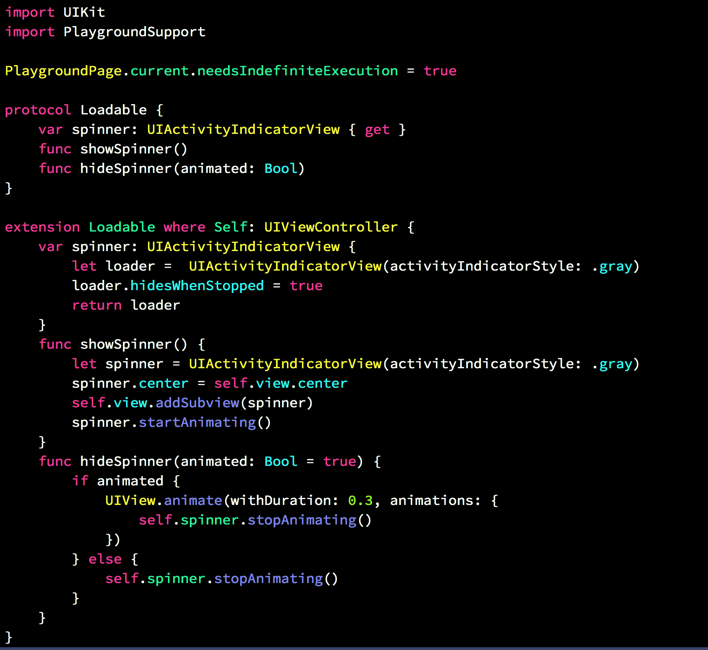

# xcode-theme
My Dark Color Xcode Theme

## Extra Dark Theme

## Blue background - Dark Theme

## Steps to install 

1. Clone this repo:
$ git clone https://github.com/suhitp/xcode-theme.git

2. Create a folder at this path if it doesn't exist already:
~/Library/Developer/Xcode/UserData/FontAndColorThemes

3. Copy the files Extra Dark.xccolortheme and Suhit Dark Theme.xccolortheme into the above folder.

4. For Extra Dark theme 'Source Code Pro' Font is used. Download the font from 

5. Unzip the font archive and move the files in the TTF folder to ~/Library/Fonts

6. Restart the Xcode 

7. Open Xcode preferences -> Colors and Font -> Select Extra Dark Theme
